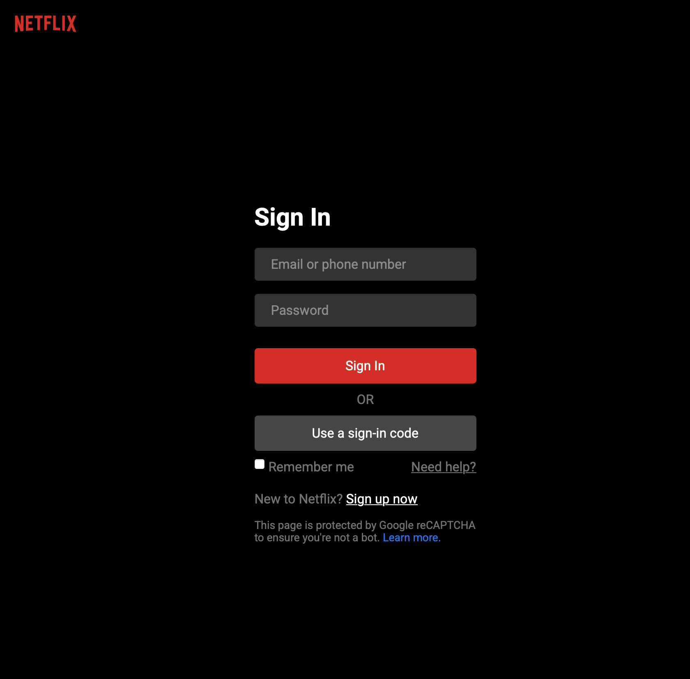
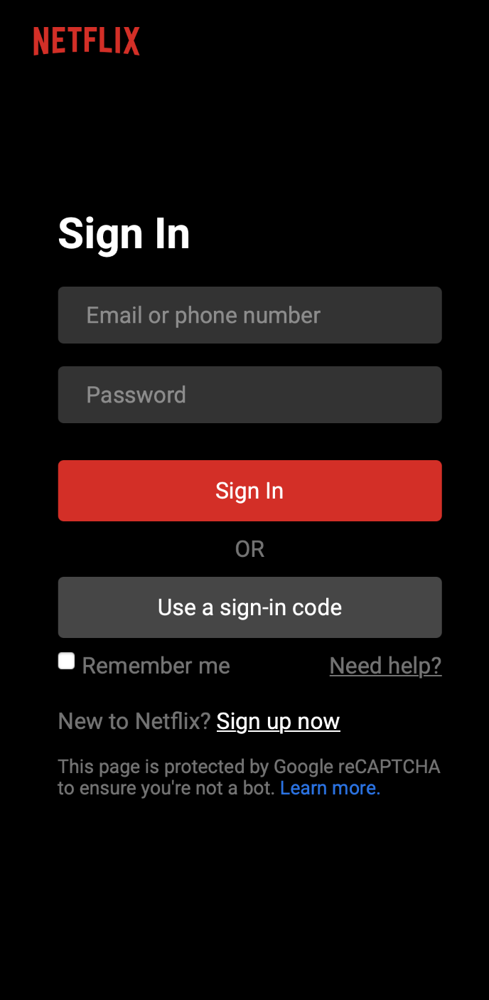

# 🎬 Netflix Sign In Clone  

  

## 📖 Descripción  
Este es un clon de la página de inicio de sesión de **Netflix**, creado con **HTML, CSS**.  
El objetivo del proyecto es **practicar diseño responsivo, animaciones CSS**.  

## 🌟 Características  
✅ Diseño idéntico a la página oficial de Netflix  
✅ **Responsive** (compatible con móviles y tablets)  
✅ **Animaciones en CSS** para una mejor experiencia de usuario  

## 🛠️ Tecnologías Usadas  
- **Frontend:** HTML5, CSS3
- **Estilos:** Flexbox, Grid, Animaciones CSS  
- **Deploy:** Vercel / Netlify / GitHub Pages  

## 📸 Capturas de Pantalla  

